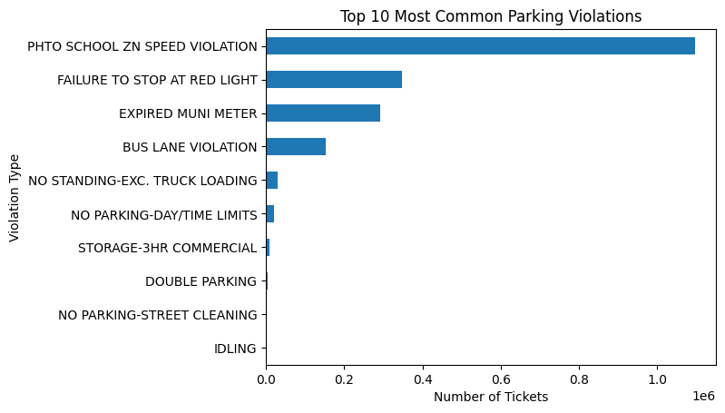
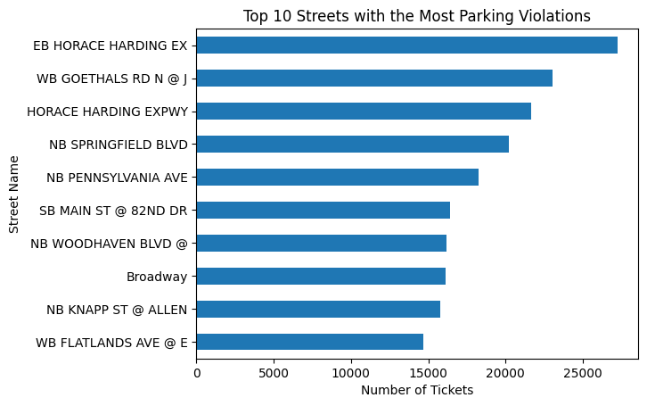
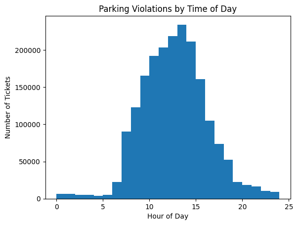

# Parking-Violations-Analysis.

# NYC Parking Violations Analysis

## Project Overview

This project analyzes parking violations issued in New York City from 2017 to 2020. The goal is to identify the most common types of parking violations, where violations occur most often, and when violations are most likely to happen.

## Research Questions

1. What are the most common parking violation types?
2. Which streets have the highest number of parking violations?
3. What time of day are parking violations most common?
4. Which days of the week have the most violations?

## Dataset

The project uses NYC parking violations data from NYC Open Data. The dataset includes information such as issue date, violation code, vehicle details, violation time, borough, and street name.

Due to file size, the raw dataset is not included in this repository.

## Tools Used

- Python
- Pandas
- Matplotlib
- Jupyter Notebook

## Key Findings

### Most Common Violations

The most common violation was photo school zone speed violation, followed by failure to stop at a red light, expired muni meter, and bus lane violation.



### Streets with the Most Violations

The streets with the highest number of violations included EB Horace Harding Expressway, WB Goethals Road, and Horace Harding Expressway.


### Violations by Time of Day

Parking violations were most common during daytime hours, especially between around 10 AM and 3 PM.



### Violations by Day of Week

Violations were highest during weekdays, especially Wednesday and Thursday. Weekend violations were much lower.



## Conclusion

The analysis shows that NYC parking violations are concentrated around specific violation types, locations, and times. Daytime hours and weekdays have the highest ticket activity, while weekends show fewer violations. The results suggest that drivers are more likely to receive tickets during workday hours when parking demand and enforcement activity are higher.

## How to Run This Project

1. Clone this repository.
2. Install the required packages:

```bash
pip install -r requirements.txt
